# Online Texas Hold'em Poker — System Design and Overall Architecture

**Project:** MMA301 Group 2 — Online Texas Hold'em Poker (play money)
**Document type:** Requirement & Design Specification — System Design and Overall Architecture
**Method:** COMET (Collaborative Object Modeling and Architectural Design Method)
**Date:** [PROPOSED — confirm with team]

---

## Table of Contents

1. [Introduction](#1-introduction)
2. [Actors](#2-actors)
3. [Use Case Model — Complete Inventory](#3-use-case-model--complete-inventory)
4. [Detailed Use Case Specifications](#4-detailed-use-case-specifications)
5. [Analysis Modeling — Static Modeling](#5-analysis-modeling--static-modeling)
6. [Analysis Modeling — Object and Class Structuring](#6-analysis-modeling--object-and-class-structuring)
7. [Overall Software Architecture](#7-overall-software-architecture)
8. [Software Quality Attributes](#8-software-quality-attributes)
9. [Traceability Matrix](#9-traceability-matrix)

---

## 1. Introduction

### 1.1 Purpose

This document specifies the requirements model and the overall software architecture for the
online Texas Hold'em poker system. It follows the COMET method: use case modeling produces
the functional requirements, static modeling produces the entity class model, object and class
structuring allocates software objects into boundary / entity / control / application-logic
categories, and the quality attributes drive the architectural decisions.

### 1.2 Scope

The system is a play-money Texas Hold'em poker platform. No real currency exists anywhere in
the system — deposits and withdrawals are simulated ledger operations with no external payment
gateway. This is a deliberate scope contrast with a commerce system: there is no PCI boundary,
no payment gateway actor, and no email/SMS actor. There is also no unauthenticated "guest"
capability beyond registering or logging in — everything else requires an account.

| Domain | Coverage |
|---|---|
| Identity & session | Registration, login, refresh/rotation, logout, ban gating |
| Wallet & ledger | Simulated deposit/withdrawal, buy-in/cash-out, auditable transaction history |
| Lobby & tables | Browse open tables, join/leave a seat, table creation restricted to staff |
| Realtime game engine | WebSocket-driven betting rounds, server-authoritative rules, showdown & settlement |
| Bots | Four difficulty tiers seated like players, policy-driven, card-visibility enforced at compile time |
| Moderation & trust | Table creation/closure, user search, ban/unban, role assignment |
| Social (partially built) | In-table chat (live), table hand log (live), friends / leaderboard / cross-table history (contracts only, not yet implemented) |

### 1.3 Technology Stack

| Layer | Technology |
|---|---|
| Client | Expo (React Native) + TypeScript, Expo Router — one codebase for iOS, Android, and web |
| Server | Node.js + Fastify + TypeScript |
| Realtime | WebSocket (`@fastify/websocket`), single `/ws` endpoint, JSON message protocol |
| Data | MongoDB (raw driver, JSON Schema validators — no ODM), single-node replica set `rs0` |
| Cache / pub-sub | Redis — connected and health-checked; pub/sub channel constants exist in the contract but are not yet wired into the broadcast path (see §7.7 Callout A) |
| Auth | JWT access (15 min) + refresh token (30 days, single-use rotation), Argon2id password hashing, role-based middleware |
| Shared contracts | `packages/shared` — Zod schemas compiled against by both client and server |
| Rules engine | `packages/poker` — pure functions, no I/O, unit tested |
| Deployment | Docker Compose; Cloudflare Tunnel to a domain (no inbound port opened on the host) |

### 1.4 Definitions and Acronyms

| Term | Meaning |
|---|---|
| UC | Use Case |
| WS | WebSocket |
| RBAC | Role-Based Access Control |
| JWT | JSON Web Token |
| TTL | Time To Live (MongoDB automatic document expiry) |
| Equity | A bot's Monte-Carlo-estimated probability of winning the hand |
| COMET | Collaborative Object Modeling and Architectural Design Method |

---

## 2. Actors

Per the COMET method, an actor is an external entity that interacts with the system. This
system defines three human actors in a single generalization chain, plus one non-human
secondary actor.

| Actor | Type | Description |
|---|---|---|
| **User** | Primary, human | Any authenticated player. Registers, logs in, manages their simulated wallet, browses and joins open tables, plays hands, chats at a table, and reads that table's public hand log. |
| **Moderator** | Primary, human | Staff account. **Generalizes User** — inherits every User capability and adds table administration (tables can be created *only* by a moderator or admin — a plain user has no such capability) and trust/safety actions (search users, ban/unban). |
| **Admin** | Primary, human | System administrator. **Generalizes Moderator** — additionally changes any user's role, may ban a moderator or another admin (which a moderator cannot do), and bypasses the table-ownership check that otherwise restricts a moderator to managing bots only on tables they created. |
| Bot | Secondary, internal | A `users` account flagged `isBot:true`, seated like a player but driven entirely by server-side policy code (`packages/poker/src/bot/*`). It never authenticates and never initiates a use case on its own — a Moderator or Admin always seats it. It participates directly in the betting protocol (posts blinds, acts, folds) indistinguishably from a human player once seated. |

Unlike a system with an unauthenticated browsing tier (a "Guest" that later registers to become
a "Customer"), this system has **no capability available without an account** beyond the
register/login screen itself — there is no public room browsing, no external payment gateway,
and no email/SMS provider. That absence is a deliberate scope decision, not an omission.

**Why Bot is not given a full use-case column.** A Bot is technically a `users` document and,
once seated, is indistinguishable from a human player at the `Table`/`HandState` level — it
calls the same `legalActions()` and the same `act()` path. But it never logs in, never holds a
JWT, and is never the actor who *initiates* a use case (a Moderator always initiates "Add Bot to
Table" on its behalf). It is therefore modeled as a **secondary actor**, referenced only inside
the use cases where it participates (§4 UC-U14 Play a Betting Action, §4 UC-M04 Add Bot to
Table) rather than given its own inventory in §3.

### 2.1 Actor Generalization Hierarchy

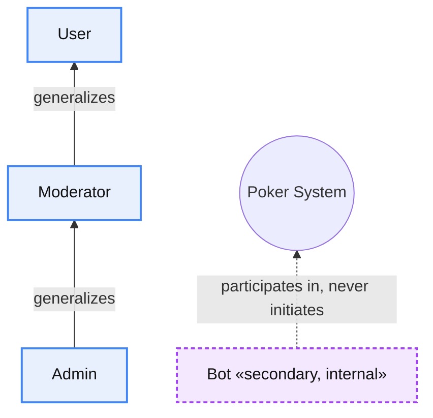

An actor that generalizes another inherits all of its use cases. `Moderator` therefore
participates in `Login`, `View Wallet`, `Join Table` and every other `User` use case in addition
to table administration and trust/safety actions. `Admin` inherits everything from both `User`
and `Moderator`.

---

## 3. Use Case Model — Complete Inventory

ID prefixes: **UC-U** (User — the base tier), **UC-M** (Moderator — additive to User's), **UC-A**
(Admin — additive to Moderator's). Because of generalization, each actor's table below lists
only use cases newly introduced at that level; a Moderator has every `UC-U` row plus their own
`UC-M` rows, and an Admin has all of both plus their own `UC-A` rows.

Column **Rel.** gives the relationship to the base use case: `Base` = directly associated with
the actor, `Include` = always executed as part of the base, `Extend` = conditionally extends the
base. A **†** marks a use case whose contract already exists in `packages/shared` but has no
server route yet — the client screen for it runs entirely against local mock data (see §9, note 6).

### 3.1 User (UC-U)

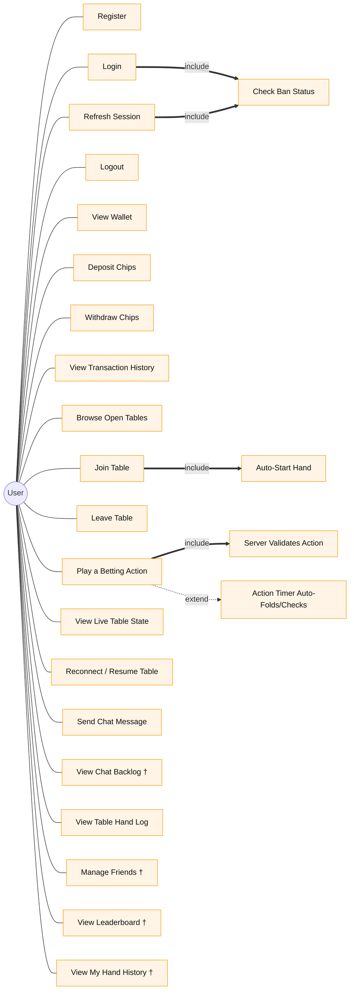

| ID | Use Case | Rel. | Summary | Priority |
|---|---|---|---|---|
| UC-U01 | **Register** | Base | Create an account with email/password/display name; credited 10,000 starting chips and a zeroed `playerStats` row. | **High** |
| UC-U02 | **Login** | Base | Authenticate with email + password; constant-time check against a dummy hash on miss; blocked if banned. | **High** |
| UC-U03 | Check Ban Status | Include (of Login, Refresh Session) | Reject an active ban, or lazily lift an expired one, before issuing any session token. | High |
| UC-U04 | Refresh Session | Base | Exchange a valid refresh token for a new access+refresh pair (single-use rotation). | High |
| UC-U05 | Logout | Base | Revoke the current or all refresh tokens for the account. | Medium |
| UC-U06 | View Wallet | Base | See chip balance and the 20 most recent transactions. | High |
| UC-U07 | Deposit Chips | Base | Simulated top-up (100–100,000 range), atomic ledger write. | High |
| UC-U08 | Withdraw Chips | Base | Simulated withdrawal (100–1,000,000 range), rejected if insufficient. | High |
| UC-U09 | View Transaction History | Base | Cursor-paginated full chip ledger. | Medium |
| UC-U10 | Browse Open Tables | Base | List up to 50 open, non-private tables. | High |
| UC-U11 | **Join Table** | Base | Seat at a table, debit the buy-in, may auto-start a hand. | **High** |
| UC-U12 | Auto-Start Hand | Include (of Join Table) | System starts a hand automatically once 2+ seated players are idle. | High |
| UC-U13 | Leave Table | Base | Vacate a seat, refund the remaining stack. | High |
| UC-U14 | **Play a Betting Action** | Base | Fold/check/call/bet/raise over the WS `player_action` message; independently re-validated server-side. | **High** |
| UC-U15 | Server Validates Action | Include (of Play a Betting Action) | Every action is re-checked against `legalActions()` regardless of what the client UI allowed. | High |
| — | Action Timer Auto-Folds/Checks | Extend (of Play a Betting Action) | If no action arrives within 30s, the server auto-folds or auto-checks on the idle player's behalf. | High |
| UC-U16 | View Live Table State | Base | Subscribe over WS; receive a per-viewer redacted `table_state` snapshot on every change. | High |
| UC-U17 | Reconnect / Resume Table | Base | Re-subscribe after a dropped connection; always receives a full snapshot, never a delta replay. | High |
| UC-U18 | Send Chat Message | Base | Post a chat message; only seated players may send. | Medium |
| UC-U19 | View Chat Backlog † | Base | Fetch chat history for a table. **MOCK** — sending is live over the socket, backlog fetch has no route yet. | Low |
| UC-U20 | **View Table Hand Log** | Base | See finished hands at one table: public betting actions always, cards only if shown at a contested showdown. | **High** |
| UC-U21 | Manage Friends † | Base | Send/accept/list friend requests. **MOCK** — the `friendships` collection exists; no route reads or writes it. | Low |
| UC-U22 | View Leaderboard † | Base | Rankings by chips / hands won / biggest pot. **MOCK** — `playerStats` is written but has no read endpoint; the WS `subscribe_leaderboard` message is a documented no-op. | Low |
| UC-U23 | View My Hand History † | Base | Cross-table "my hands" view with replay. **MOCK** — distinct from UC-U20, which is table-scoped and live. | Low |

### 3.2 Moderator (UC-M) — additive to User

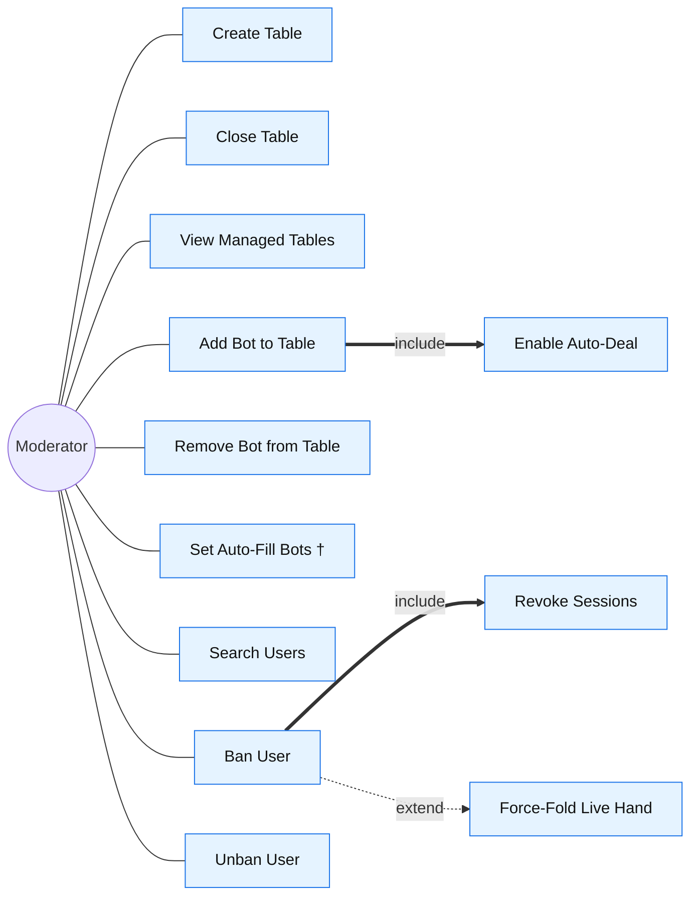

| ID | Use Case | Rel. | Summary | Priority |
|---|---|---|---|---|
| UC-M01 | **Create Table** | Base | Open a new table. The *only* route to table creation — plain users cannot create tables. | **High** |
| UC-M02 | **Close Table** | Base | Close a table; rejected while a hand is in progress. | **High** |
| UC-M03 | View Managed Tables | Base | List all tables, including closed/private ones, for administration. | Medium |
| UC-M04 | **Add Bot to Table** | Base | Seat a free `isBot:true` account at a seat with a chosen difficulty; owner or admin only. | **High** |
| UC-M05 | Enable Auto-Deal | Include (of Add Bot to Table) | Table is flagged so it keeps dealing itself — a bot-only table would otherwise stall after one hand. | Medium |
| UC-M06 | Remove Bot from Table | Base | Remove a seated bot; rejected (409) if that bot is mid-hand. | Medium |
| UC-M07 | Set Auto-Fill Bots † | Base | Toggle `autoFillBots`/`autoFillDifficulty` on a table. **Known gap** — nothing currently consumes these flags to actually seat bots. | Low |
| UC-M08 | Search Users | Base | Search accounts by display name. | Medium |
| UC-M09 | **Ban User** | Base | Ban an account with a reason ± duration; cannot ban self; admin required to ban an admin. | **High** |
| UC-M10 | Revoke Sessions | Include (of Ban User) | All live refresh tokens for the account are revoked immediately. | High |
| — | Force-Fold Live Hand | Extend (of Ban User) | If the banned player is mid-hand, they are folded; already-committed chips stay in the pot. | High |
| UC-M12 | Unban User | Base | Clear a ban. | Low |

### 3.3 Admin (UC-A) — additive to Moderator

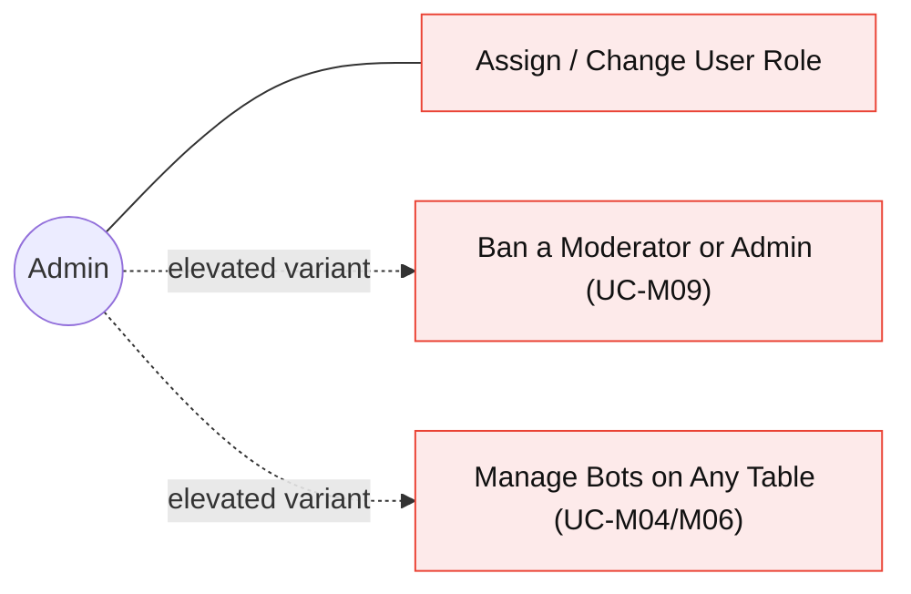

| ID | Use Case | Rel. | Summary | Priority |
|---|---|---|---|---|
| UC-A01 | **Assign/Change User Role** | Base | Set any user's role to user/moderator/admin; cannot change own role; revokes sessions to force re-login. | **High** |
| — | Ban a Moderator or Admin | Variant (of UC-M09) | Only an admin may ban a target whose role is moderator or admin — same use case, elevated actor. | Medium |
| — | Manage Bots on Any Table | Variant (of UC-M04/M06) | Admin bypasses the table-owner check that restricts a moderator to their own tables. | Medium |

### 3.4 Use Case Count Summary

| Actor | Base | Include | Extend | Total (incl. MOCK) |
|---|---|---|---|---|
| User | 19 | 3 | 1 | 23 (4 marked †) |
| Moderator (additive) | 8 | 2 | 1 | 11 (1 marked †) |
| Admin (additive) | 1 | 0 | 0 | 1 base + 2 elevated variants |
| **System total** | **28** | **5** | **2** | **35** (5 marked †) |

[PROPOSED — confirm with team: whether elevated variants (Admin's UC-A02/UC-A03) should count as
distinct rows or remain footnoted against their base Moderator use case in the team's final count.]

---

## 4. Detailed Use Case Specifications

Twelve use cases are specified in full below, selected for carrying the core value of the system
(register → wallet → join → bet → showdown), the highest concurrency/architectural risk (seat
races, atomic chip updates, the realtime betting loop), and the trust/safety model unique to this
system (moderator-only table creation, ban-while-mid-hand).

| # | ID | Use Case | Primary Actor | Why detailed |
|---|---|---|---|---|
| 1 | UC-U01 | Register | User | Entry point; establishes the chip-ledger and playerStats invariants every later flow depends on |
| 2 | UC-U02 | Login | User | Security-critical path (constant-time check, ban gate); the pattern Refresh Session reuses |
| 3 | UC-U11 | Join Table (+ Auto-Start Hand) | User | Concurrency-critical: seat-claim race, debit/refund rollback, triggers the realtime subsystem |
| 4 | UC-U14 | Play a Betting Action | User / Bot | The core realtime loop — highest architectural risk in the system (WS protocol, 30s timer, single-broadcast guarantee, server-authoritative re-validation) |
| 5 | UC-U14a | Showdown & Settlement | System | Server-authoritative resolution: pot splitting, persist-before-broadcast ordering, `hand_finished` contract |
| 6 | UC-U07/08 | Deposit / Withdraw Chips | User | The atomic-update engineering rule in practice — this system's analogue to a payment-idempotency scenario, but for an internal ledger with no external gateway |
| 7 | UC-U20 | View Table Hand Log | User | Encodes a genuinely novel business rule: betting is public, cards are private |
| 8 | UC-M09 | Ban User | Moderator | Cross-cutting: touches identity (session revocation), the game engine (force-fold), and pot integrity in one flow |
| 9 | UC-M01 | Create Table | Moderator | Establishes the moderator-only table-creation invariant central to this system's trust model |
| 10 | UC-M02 | Close Table | Moderator | Concurrency guard against closing a table mid-hand; complements Create Table |
| 11 | UC-M04 | Add Bot to Table | Moderator | Unique to this system; exercises the compile-time card-visibility guarantee and the `autoDeal` side effect |
| 12 | UC-A01 | Assign/Change User Role | Admin | Admin-only privilege-escalation path; session revocation on role change is a distinct security pattern from banning |

---

### UC-U01 — Register

| Field | Value |
|---|---|
| **ID and Name** | UC-U01 — Register |
| **Created By** | [team member] |
| **Date Created** | [PROPOSED — confirm with team] |
| **Primary Actor** | User (unauthenticated visitor) |
| **Secondary Actors** | — |
| **Trigger** | Visitor submits the registration form on the combined login/register screen. |

**Description**
Creates an account from an email, password, and display name. The system credits 10,000
starting chips with a matching ledger entry, opens an empty `playerStats` row, and issues an
authenticated session — registration and first login happen in one step.

**Preconditions**
- PRE-1: No existing account uses the submitted email (case-insensitive).

**Postconditions**
- POST-1: A `users` document exists with role `user` and 10,000 chips.
- POST-2: A `chipTransactions` row of kind `bonus` records the starting grant (`balanceAfter = 10000`).
- POST-3: A zeroed `playerStats` row exists for the account.
- POST-4: An access token (15 min) and refresh token (30 days) are returned.

**Normal Flow — 1.0: Self-registration**
1. The visitor fills email, password (8–128 chars), and display name (1–64 chars) and submits.
2. The client sends `POST /api/v1/auth/register`.
3. The system validates the body against the Zod schema.
4. The system hashes the password with Argon2id.
5. The system inserts the `users` document; the email's unique index is the sole existence check — there is no separate lookup-then-insert.
6. The system inserts a `bonus` `chipTransactions` row (amount 10,000, `balanceAfter` 10,000).
7. The system inserts a zeroed `playerStats` row.
8. The system signs an access token and generates and stores a hashed refresh token.
9. The system responds 201 with `{user, tokens}`.
10. The client stores the tokens and navigates to the lobby.

**Alternative Flows**
- None beyond the exception path below.

**Exceptions**
- **1.0.E1 — Email already registered:** the unique index rejects the insert; mapped to `409 Conflict` ("An account with that email already exists"). No lookup-then-insert race window exists.
- **1.0.E2 — Body fails validation:** `400 Bad Request` with field-level details.

| Field | Value |
|---|---|
| **Priority** | High |
| **Frequency of Use** | Once per account; low relative to logins. |
| **Business Rules** | BR-01 Starting balance is fixed at 10,000 chips. BR-02 Role always starts as `user`. BR-03 The email unique index is case-insensitive. |
| **Non-functional** | Argon2id hashing (memoryCost 19456, timeCost 2) is deliberately slow to resist brute force. |
| **Assumptions** | Client-side validation mirrors but never replaces server-side validation. |

---

### UC-U02 — Login

| Field | Value |
|---|---|
| **ID and Name** | UC-U02 — Login |
| **Primary Actor** | User |
| **Secondary Actors** | — |
| **Trigger** | User submits email + password. |

**Description**
Authenticates an existing account and issues a session, refusing banned accounts and lazily
lifting bans that have already expired.

**Preconditions**
- PRE-1: An account exists for the given email (not required to be known to the caller).

**Postconditions**
- POST-1: On success, a new access+refresh token pair is issued and the refresh token is stored.
- POST-2: On failure, no session is created and no response detail discloses whether the email exists.

**Normal Flow — 1.0: Login with email and password**
1. The user submits email + password.
2. The client sends `POST /api/v1/auth/login`.
3. The system looks up the user by email (case-insensitive).
4. The system verifies the password against the stored Argon2id hash — **if no account is found, it verifies against a fixed dummy hash anyway**, so response timing never discloses account existence.
5. The system runs Check Ban Status (UC-U03, included): an expired ban is cleared and the flow continues; an active ban is rejected.
6. The system issues the session (signs the JWT, generates and stores the refresh token).
7. The system returns `{user, tokens}`.

**Alternative Flows**
- **1.1: Ban has expired** — the ban is cleared in the same request, before the session is issued; the flow continues at step 6 without interruption.

**Exceptions**
- **1.0.E1 — Unknown email or wrong password:** `401 Unauthorized` ("Incorrect email or password") — identical message and timing shape for both cases, to prevent account enumeration.
- **1.0.E2 — Account actively banned:** `403 Forbidden` with the ban reason and expiry (or "indefinite").

| Field | Value |
|---|---|
| **Priority** | High |
| **Frequency of Use** | Very high — every session start. |
| **Business Rules** | BR-04 Ban status is checked on every token-issuing path, not just login. |
| **Non-functional** | The dummy-hash comparison on a miss keeps verification time constant-shaped, resisting timing-based user enumeration. Access token TTL 15 min, refresh TTL 30 days. |
| **Assumptions** | A failed access token triggers exactly one client-side refresh attempt before surfacing an error; that retry is outside this use case. |

---

### UC-U11 — Join Table (+ Auto-Start Hand)

| Field | Value |
|---|---|
| **ID and Name** | UC-U11 — Join Table |
| **Primary Actor** | User |
| **Secondary Actors** | System (auto-deal trigger) |
| **Trigger** | User selects an open table and a buy-in from the lobby. |

**Description**
Seats the player at a chosen (or auto-assigned) seat and debits the buy-in from their wallet as
a single atomic, rollback-safe operation. If this brings the table to two or more seated players,
a hand starts automatically.

**Preconditions**
- PRE-1: The user is authenticated and not already seated at this table.
- PRE-2: The table is open. If private, a valid join code is supplied.

**Postconditions**
- POST-1: The user occupies a seat with `stack = buyIn`.
- POST-2: A `buy_in` `chipTransactions` row exists.
- POST-3: If the table now has ≥2 seated players and no hand is running, a new hand exists in memory and the table's status becomes `in_hand`.

**Normal Flow — 1.0: Join and auto-start**
1. The user picks a table, a seat (or "any"), and a buy-in within `[minBuyIn, maxBuyIn]`.
2. The client sends `POST /api/v1/tables/:id/join`.
3. The system loads the live table instance from the in-memory registry (lazily created from Mongo if not already live).
4. The system validates: not already seated, buy-in in range, join code matches if the table is private, a free seat exists.
5. The system debits the buy-in with a single atomic conditional update guarded by `chips >= buyIn`.
6. The system claims the seat with a conditional update that only matches if that seat is still empty — this is what makes two racing joins on the same seat safe.
7. The system starts a new hand if ≥2 seated players are now idle *(«include» UC-U12 Auto-Start Hand)*.
8. The system returns the caller's per-viewer redacted table state.
9. If a hand started, every WS subscriber for that table receives the updated `table_state` broadcast.

**Alternative Flows**
- **1.1: Seat lost the race** — the conditional seat-claim update matches zero documents (another join won first). The system refunds the buy-in via a `cash_out` ledger entry and returns `409 Conflict` ("That seat was just taken"). No chips are lost or duplicated.
- **1.2: Fewer than two seated after join** — the join succeeds; no hand starts; the table remains `open`.

**Exceptions**
- **1.0.E1 — Buy-in outside range:** `400 Bad Request`.
- **1.0.E2 — Already seated at this table:** `409 Conflict`.
- **1.0.E3 — Private table, wrong/missing join code:** `403 Forbidden`.
- **1.0.E4 — Table full:** `409 Conflict`.
- **1.0.E5 — Insufficient chips for the debit:** `400 Bad Request`.

| Field | Value |
|---|---|
| **Priority** | High |
| **Frequency of Use** | Very high. |
| **Business Rules** | BR-05 The debit happens before the seat claim, with a compensating refund if the seat claim fails — chips must never be lost or duplicated. BR-06 A hand auto-starts the moment two or more players are seated and idle. |
| **Non-functional** | The seat claim uses a MongoDB conditional update rather than a distributed lock, keeping concurrent joins race-safe without external coordination. |
| **Assumptions** | The table's authoritative in-memory instance already exists, or is lazily created by the registry lookup. |

---

### UC-U14 — Play a Betting Action

| Field | Value |
|---|---|
| **ID and Name** | UC-U14 — Play a Betting Action |
| **Primary Actor** | User (seated player) — also triggered internally for Bot via the bot-driver |
| **Secondary Actors** | Bot (when the acting seat is bot-controlled), System (30-second action timer) |
| **Trigger** | It becomes the player's turn and they submit fold/check/call/bet/raise, or the 30-second timer expires. |

**Description**
The central realtime gameplay loop. A seated player whose turn it is sends a `player_action`
WebSocket message; the server independently re-validates it against the rules engine's legal-action
computation regardless of what the client UI permitted, applies it through the pure betting state
machine, advances the hand, and broadcasts the updated per-viewer state to every subscriber
exactly once.

**Preconditions**
- PRE-1: A hand is in progress at the table.
- PRE-2: It is this player's turn.
- PRE-3: The player has not been banned during this hand.

**Postconditions**
- POST-1: The action is recorded in the hand's action log.
- POST-2: Chips move between the player's stack, their committed amount, and the pot as appropriate.
- POST-3: The acting player advances, or the street advances, or the hand completes.
- POST-4: The table's sequence counter increments by exactly one, and exactly one state broadcast is sent to all subscribers.

**Normal Flow — 1.0: A legal action**
1. The client renders legal actions and bet/raise bounds from the server-computed values in the last table-state snapshot.
2. The player picks an action and, for bet/raise, a total commitment amount via the slider or manual entry.
3. The client sends `{type:'player_action', tableId, requestId, action:{type, amount}}` over the open WS connection.
4. The server calls the table's action handler with the player's id, action type, and amount.
5. The handler checks a hand is running, it's this player's turn, and the player isn't banned this hand.
6. The handler applies the action through the pure rules engine, which independently re-derives legality — fold is always legal; check only if nothing is owed; call only if something is owed; bet/raise only if the target exceeds the current bet, fits the stack, and meets the minimum raise unless it is an all-in.
7. On success, the action is appended to the hand's log, chips move, and the engine determines the next actor, street, or completion.
8. The table's sequence counter increments.
9. If the hand is now complete, settlement runs asynchronously *(→ UC-U14a)*; otherwise the 30-second timer restarts for the new acting player, triggering the bot driver if that seat is a bot.
10. The table broadcasts exactly once, sending every connected viewer their own redacted snapshot.
11. The server sends an action result back to the acting client only, echoing their request id.

**Alternative Flows**
- **1.1: Illegal action rejected** — step 6 throws an invalid-action error (for example, a raise below the minimum, or checking while facing a bet). The handler returns a rejection to the acting client only; no broadcast occurs and no state changes.
- **1.2: 30-second timeout (system-initiated)** — if no action arrives before the deadline, the server auto-submits check (if legal) or fold on the idle player's behalf, through the same action path.
- **1.3: Acting seat is a bot** — the timer arm detects a bot profile on the acting seat and schedules a policy-driven decision (a 600–3000ms simulated "thinking" delay) that ultimately calls the same action path a human action would use *(→ UC-M04 for the bot subsystem)*.
- **1.4: Banned mid-hand** — if the acting player was banned during this hand, their action attempt is rejected; in practice the ban flow itself force-folds them immediately, so this path is rarely reached *(→ UC-M09)*.

**Exceptions**
- **1.0.E1 — No hand in progress:** rejected.
- **1.0.E2 — Not this player's turn:** rejected.
- **1.0.E3 — Malformed WS message:** an error message is sent; the connection stays open.

| Field | Value |
|---|---|
| **Priority** | High |
| **Frequency of Use** | Extremely high — every hand, every street. |
| **Business Rules** | BR-07 The server is the sole authority on legality; client-shown options are advisory only. BR-08 Heads-up blind/first-actor rules, minimum-raise sizing, and an all-in short of a full raise not reopening betting are all engine-enforced. |
| **Non-functional** | Exactly one broadcast per action. Action timeout fixed at 30 seconds. [PROPOSED — confirm with team: server processing latency target, e.g. < 300ms.] |
| **Assumptions** | The client's own countdown UI is cosmetic; the server's deadline timestamp is authoritative. |

---

### UC-U14a — Showdown and Hand Settlement

*(The natural continuation of UC-U14 when the engine determines the hand is over. Specified
separately because it carries independent architectural risk — persistence ordering, pot math,
and statistics updates.)*

| Field | Value |
|---|---|
| **ID and Name** | UC-U14a — Showdown and Hand Settlement |
| **Primary Actor** | System (triggered by the last betting action of a hand) |
| **Secondary Actors** | All seated players (recipients), Bot(s) if present |
| **Trigger** | The engine determines the hand is over — one player remains, or all streets are exhausted. |

**Description**
The rules engine computes side pots from commitment levels, evaluates hands for any showdown,
distributes chips including odd-chip resolution, and marks the hand complete. The server then
persists the finished hand to MongoDB, updates seat stacks and player statistics, and notifies
clients — strictly in that order, so a client that reacts to the notification is guaranteed to
find the persisted record.

**Preconditions**
- PRE-1: A hand is in progress and the final action just resolved it (a fold-out, a completed river action, or an all-in runout reaching the river).

**Postconditions**
- POST-1: The hand's street becomes `complete` with results populated.
- POST-2: A `hands` document is inserted.
- POST-3: Table seat stacks reflect the final amounts.
- POST-4: `playerStats` is incremented for human participants only — never for bots.
- POST-5: A `hand_finished` message has been sent to all table subscribers.
- POST-6: The table's status returns to `open`; if auto-deal is set, the next hand is scheduled after a short delay.

**Normal Flow — 1.0: Settlement**
1. The engine detects the terminal condition and runs settlement.
2. Side pots are built from each player's total committed chips.
3. If only one live player remains, they win every pot uncontested — no cards are evaluated or shown.
4. Otherwise, each live player's best five-card hand is evaluated from hole cards and the board; for each pot, the highest-ranking eligible player(s) win; ties split, with any odd chip going to the earliest seat after the button.
5. The hand's street becomes `complete`, results are populated, and no player remains "acting."
6. Seat stacks are copied from the settled hand; the table's status returns to `open`.
7. The finished hand is recorded into the in-memory opponent-modelling store (feeding the expert bot tier) before persistence, so a later persistence failure doesn't lose that read.
8. The system persists: inserts a `hands` document — with each player's hole cards populated **only** if that player reached a contested showdown, plus the full public action log — then updates the table's seats, status, hand number, and button seat, then increments `playerStats` for human participants (bots are excluded).
9. The table's sequence counter increments and the final state broadcasts to all subscribers.
10. **Only after persistence succeeds**, a `hand_finished` message fires to every subscriber — the signal a client uses to refetch the hand log, guaranteed to find the record.
11. If auto-deal is set on the table (always true once any bot has been seated), a new hand is scheduled a few seconds later, giving clients time to render the showdown before cards disappear.

**Alternative Flows**
- **1.1: Uncontested fold-out** — step 3's short-circuit; no hand evaluation occurs, and no cards are recorded for the winner. The hand log will show no cards at all for this hand.
- **1.2: All-in runout** — if all remaining active players are all-in before the river, remaining streets are dealt automatically with no further action requests, then settlement proceeds.
- **1.3: Persistence failure** — a write during step 8 throws; the error is caught and logged, but the table is **not** wedged — the sequence still increments, the final state still broadcasts, and the next hand still schedules. Only this one hand is missing from history.

**Exceptions**
- None beyond the alternative flows above; a split pot with an odd chip is resolved deterministically, not treated as an error.

| Field | Value |
|---|---|
| **Priority** | High |
| **Frequency of Use** | Once per completed hand — very frequent. |
| **Business Rules** | BR-09 Cards are recorded and shown only at a contested showdown, never on a fold-out. BR-10 Side pots respect commitment-level eligibility, so a short all-in player can only win, from each opponent, what they themselves contributed. |
| **Non-functional** | The `hand_finished` notification must fire strictly after persistence completes — this ordering is a correctness requirement, not a performance tweak. A write failure must degrade gracefully rather than crash the table. |
| **Assumptions** | The in-memory hand state is the sole source of truth until the moment of persistence; a process crash before that point loses the hand entirely (a documented single-process trade-off — see §7.7 Callout A). |

---

### UC-U07 / UC-U08 — Deposit / Withdraw Chips (Wallet)

| Field | Value |
|---|---|
| **ID and Name** | UC-U07 — Deposit Chips (UC-U08 Withdraw Chips is the mirror-image debit variant, documented together) |
| **Primary Actor** | User |
| **Secondary Actors** | — (no external payment gateway; a simulated ledger only) |
| **Trigger** | User submits an amount on the Wallet screen. |

**Description**
Credits (deposit) or debits (withdraw) the player's simulated chip balance and records an
auditable ledger entry carrying the resulting balance. No real currency or external payment
system is involved anywhere in this flow.

**Preconditions**
- PRE-1: The user is authenticated.
- PRE-2: For withdrawal, the account holds at least the requested amount.

**Postconditions**
- POST-1: The chip balance reflects the new amount.
- POST-2: A `chipTransactions` row (kind `deposit` or `withdrawal`, signed amount, resulting balance) is inserted.

**Normal Flow — 1.0: Deposit (withdrawal is symmetric, with a negative amount and a balance guard)**
1. The user enters an amount within [100, 100,000] for a deposit ([100, 1,000,000] for a withdrawal).
2. The client sends `POST /api/v1/wallet/deposit` (or `/withdraw`).
3. The system validates the amount against the schema's bounds.
4. The system applies the change through a single atomic conditional update — for a withdrawal, the guard is that the balance covers the amount; a deposit needs no guard since it cannot overdraw.
5. The system inserts a `chipTransactions` row using the **actual post-update balance**, not a value computed ahead of time — so the ledger always matches what actually happened even under concurrent requests.
6. The system returns the new balance and the transaction record.

**Alternative Flows**
- None beyond the exception path.

**Exceptions**
- **1.0.E1 (withdraw only) — Insufficient chips:** the guarded update matches nothing; the system distinguishes "account not found" from "guard rejected" and returns `400 Bad Request` ("Insufficient chips").
- **1.0.E2 — Amount outside the allowed range:** `400 Bad Request`, rejected before any database call.

| Field | Value |
|---|---|
| **Priority** | High |
| **Frequency of Use** | High. |
| **Business Rules** | BR-11 All chips are simulated play money — there is no real currency, no payment gateway, and no PCI scope anywhere in this system. |
| **Non-functional** | Every chip mutation uses a single atomic conditional update — never read-then-write — per the project's own enforced engineering rule; this is the system's core Integrity requirement. |
| **Assumptions** | Deposit/withdraw bounds (100–100,000 / 100–1,000,000) are product-chosen limits, not technical ones. |

---

### UC-U20 — View Table Hand Log

| Field | Value |
|---|---|
| **ID and Name** | UC-U20 — View Table Hand Log |
| **Primary Actor** | User (seated at the table) or Moderator/Admin |
| **Secondary Actors** | — |
| **Trigger** | The player opens the hand-log panel on the table screen, or receives a `hand_finished` signal and refetches. |

**Description**
Returns the cursor-paginated record of finished hands at one specific table. Encodes a
deliberate, non-obvious rule: every action taken by anyone is public and visible forever in the
log — betting is public — but hole cards are shown only for a player who reached a contested
showdown; folded or mucked hands never reveal cards, even historically.

**Preconditions**
- PRE-1: The caller is authenticated and either currently seated at this table, or holds a moderator/admin role.
- PRE-2: A hand only appears in this record once it has ended with a result — a hand in progress is never partially visible here.

**Postconditions**
- None (read-only). The client renders a per-hand action replay and a "tendencies" view — entry
  rate, raise rate, fold rate, showdown rate — computed entirely on the client from the returned
  public actions; no server-side aggregation object backs that view.

**Normal Flow — 1.0: Read the log**
1. The client requests the hand log for the table, with an optional pagination cursor.
2. The system confirms the caller is either seated at the table or holds a moderating role.
3. The system queries finished hands for that table, newest first, applying the cursor.
4. Each hand's hole cards pass straight through — no additional filtering is needed at read time, because cards were already written as absent for anyone who didn't show down, back in UC-U14a.
5. The system returns the page of hands and the next cursor.
6. The client renders the per-hand action list and, separately, derives aggregate tendencies locally.

**Alternative Flows**
- **1.1: Moderator, not seated** — access is still granted, even though the moderator has never played at this table.

**Exceptions**
- **1.0.E1 — Caller neither seated nor moderating:** `403 Forbidden` ("Only players at this table can read its hands").
- **1.0.E2 — Table not found:** `404 Not Found`.

| Field | Value |
|---|---|
| **Priority** | High |
| **Frequency of Use** | Medium — post-hand review, not realtime-critical. |
| **Business Rules** | BR-12 Betting is public, cards are private: hole cards are stored non-null only for a contested-showdown participant. BR-13 A hand is written to the record only when it ends with a result, never as a live/partial record — this prevents a player who already folded from seeing the live betting they were excluded from. |
| **Non-functional** | Scoped to one table only — deliberately not a cross-table feature (that is UC-U23, mocked). Restricted audience prevents the lobby becoming a global player-profiling database. |
| **Assumptions** | The client-side "tendencies" view is a derivation, not a distinct server feature — see §9, note 3. |

---

### UC-M09 — Ban User

| Field | Value |
|---|---|
| **ID and Name** | UC-M09 — Ban User |
| **Primary Actor** | Moderator (or Admin) |
| **Secondary Actors** | System (session revocation, force-fold) |
| **Trigger** | Moderator selects a user in the Players tab and submits a ban reason, optionally with a duration. |

**Description**
Bans an account: blocks future logins and refreshes, immediately revokes all live sessions, and
— if the target is mid-hand at any table — force-folds them out of that hand without touching
their already-committed chips, so the pot is never corrupted.

**Preconditions**
- PRE-1: The actor holds moderator or admin role.
- PRE-2: The target account exists and is not the actor themselves.
- PRE-3: If the target's role is admin, the actor must be admin — a moderator cannot ban an admin.

**Postconditions**
- POST-1: The ban is recorded on the target's account (reason, timestamp, actor, expiry).
- POST-2: Every refresh token for the target is revoked (their current access token remains valid only until its own short expiry — an accepted latency, not a bug).
- POST-3: If seated in any open table, the target's live hand participation, if mid-hand, is folded; their seat is vacated once that hand ends, not immediately.

**Normal Flow — 1.0: Ban**
1. The moderator finds the target via user search and submits a reason and optional duration.
2. The client sends `POST /api/v1/moderation/users/:id/ban`.
3. The system checks the target isn't the actor themselves.
4. The system checks the role-hierarchy rule: if the target is an admin, the actor must be admin.
5. The system computes the expiry (indefinite if no duration is given).
6. The system sets the ban on the target's account.
7. The system revokes every refresh token for the target.
8. The system finds every open table where the target is seated.
9. For each such table's live instance, the system force-folds the target: if it is currently their turn in an active hand, they are folded through the normal action path; if they are in the hand but it isn't their turn, their status is set to folded directly. Either way, their committed chips remain in the pot.
10. The system returns confirmation with the ban's expiry.

**Alternative Flows**
- **1.1: Target not currently in any hand** — steps 8–9 find no live hand involvement; only the ban flag and session revocation apply.
- **1.2: Target is mid-hand but it isn't their turn** — folded directly via status assignment rather than through the normal action path, since that path requires it to be their turn.

**Exceptions**
- **1.0.E1 — Actor attempts to ban self:** `400 Bad Request` ("You cannot ban yourself").
- **1.0.E2 — Moderator attempts to ban an admin:** `403 Forbidden` ("Only an admin can ban an admin").
- **1.0.E3 — Target not found:** `404 Not Found`.

| Field | Value |
|---|---|
| **Priority** | High |
| **Frequency of Use** | Low to medium — disciplinary action. |
| **Business Rules** | BR-14 Chips already committed to a pot before a ban stay in the pot — clawing them back would short other players who acted in good faith. BR-15 Banning is role-hierarchical: a moderator cannot touch an admin. |
| **Non-functional** | The target's already-issued access token remains valid for up to its remaining lifetime after a ban — an accepted latency window, since server-side JWT revocation would require a blocklist the project doesn't implement. |
| **Assumptions** | Live-table lookup for the force-fold step uses a non-creating lookup, so banning a user with no live table involvement never spuriously instantiates table state. |

---

### UC-M01 — Create Table

| Field | Value |
|---|---|
| **ID and Name** | UC-M01 — Create Table |
| **Primary Actor** | Moderator (or Admin) |
| **Secondary Actors** | — |
| **Trigger** | Moderator submits the "open table" form on the moderation screen. |

**Description**
The only way a poker table is created. Ordinary users have no equivalent capability — this
keeps the public lobby a curated set of tables rather than an uncontrolled free-for-all.

**Preconditions**
- PRE-1: The actor holds moderator or admin role.

**Postconditions**
- POST-1: A new table exists, open, owned by the creator, with empty seats sized to the configured maximum, and — if private — a generated join code.

**Normal Flow — 1.0: Create**
1. The moderator specifies a name, seat count, blinds, buy-in range, and whether the table is private.
2. The client sends `POST /api/v1/moderation/tables`.
3. The system validates the submitted configuration.
4. The system builds the table document: owner set to the creator, status open, an empty seat array sized to the configured maximum, and a join code generated only if private.
5. The system inserts the document.
6. The system returns the created table.

**Alternative Flows**
- None.

**Exceptions**
- **1.0.E1 — Actor lacks moderator/admin role:** `403 Forbidden`, enforced before the handler even runs.
- **1.0.E2 — Invalid configuration (blind sizes, seat count, buy-in range):** `400 Bad Request`.

| Field | Value |
|---|---|
| **Priority** | High |
| **Frequency of Use** | Low — administrative setup. |
| **Business Rules** | BR-16 Plain users cannot create tables under any circumstance. |
| **Non-functional** | Join codes avoid visually ambiguous characters to reduce misreads when shared verbally or by text. |
| **Assumptions** | Table ownership, once set, establishes the separate authorization axis used later by bot management (owner-or-admin, independent of moderator role). |

---

### UC-M02 — Close Table

| Field | Value |
|---|---|
| **ID and Name** | UC-M02 — Close Table |
| **Primary Actor** | Moderator (or Admin) |
| **Secondary Actors** | — |
| **Trigger** | Moderator selects "close" on a table in the moderation screen. |

**Description**
Permanently closes a table, refusing to do so while a hand is actively running rather than
killing it mid-hand and stranding the pot.

**Preconditions**
- PRE-1: The actor holds moderator or admin role.
- PRE-2: The table exists.

**Postconditions**
- POST-1: The table's status becomes closed, with the reason and actor recorded.
- POST-2: The table's live in-memory instance is released from the registry, so its timers stop and it is never served again.

**Normal Flow — 1.0: Close**
1. The moderator submits an optional close reason.
2. The client sends `DELETE /api/v1/moderation/tables/:id`.
3. The system checks the live table, if any, for a hand in progress.
4. If no hand is running, the system updates the document to closed with the reason and actor.
5. The system drops the table from the in-memory registry.
6. The system confirms closure.

**Alternative Flows**
- None — the "wait for the hand to finish" case is a rejection, not a different success path.

**Exceptions**
- **1.0.E1 — A hand is currently running:** `409 Conflict` ("A hand is in progress; try again when it finishes") — the wait is bounded by at most the 30-second action clock plus normal play pace.
- **1.0.E2 — Table not found:** `404 Not Found`.

| Field | Value |
|---|---|
| **Priority** | High |
| **Frequency of Use** | Low. |
| **Business Rules** | BR-17 A close never interrupts a live hand — it refuses instead of forcing. |
| **Non-functional** | Dropping the table from the registry stops its timers, preventing a leak for closed tables. |
| **Assumptions** | A moderator retries the close request after the hand naturally finishes; no queued/scheduled close exists. |

---

### UC-M04 — Add a Bot to a Table

| Field | Value |
|---|---|
| **ID and Name** | UC-M04 — Add Bot to Table |
| **Primary Actor** | Moderator (table owner) or Admin (any table) |
| **Secondary Actors** | Bot (the seated account, subsequently autonomous) |
| **Trigger** | The table owner or an admin selects "Add Bot" with a seat and difficulty. |

**Description**
Seats a randomly chosen, currently free, pre-provisioned bot account with a fixed buy-in and a
chosen difficulty. Difficulty is stored on the seat, not the account, so the same bot account
can play as "easy" at one table and "expert" at another. Seating a bot also flips the table's
auto-deal flag, so a bot-inclusive table keeps playing hands without a human needing to trigger
each deal.

**Preconditions**
- PRE-1: The actor is the table's owner or an admin.
- PRE-2: A free bot account exists (provisioned ahead of time by a seed script — bots are never created on the fly).
- PRE-3: A seat is available.

**Postconditions**
- POST-1: The chosen seat holds the bot account, its chosen difficulty, and a fixed stack — no wallet debit occurs.
- POST-2: The table's auto-deal flag becomes true.
- POST-3: If two or more players are now seated, a hand may auto-start.

**Normal Flow — 1.0: Seat a bot**
1. The owner/admin picks a seat (or "any free seat") and a difficulty.
2. The client sends `POST /api/v1/tables/:id/bots`.
3. The system verifies the actor is the table owner or an admin.
4. The system resolves the target seat.
5. The system queries all bot accounts, filters out ones already seated at this table, and picks one at random from the remainder.
6. The system validates the buy-in against the table's configured range.
7. The system claims the seat with a conditional update (guarding against a race on the same seat), setting the account, stack, difficulty, and auto-deal in the same write.
8. The system starts a hand if the table is now ready.
9. The system returns the caller's redacted table state.

**Alternative Flows**
- **1.1: No free bot accounts** — `409 Conflict`, instructing the operator to run the bot-seeding script.
- **1.2: Bot's subsequent turns (ongoing)** — once seated, whenever it becomes the bot's turn, the server builds a read-only view of the hand for that bot — one that structurally cannot expose opponents' hole cards, a compile-time guarantee rather than a runtime filter — looks up the policy for the seat's difficulty, runs it, clamps the raw decision into a legal action, and — after a randomized "thinking" delay — submits it exactly as a human action would *(→ UC-U14)*.
- **1.3: Policy throws** — if the chosen policy function throws, the system falls back to check, then fold, so a buggy policy can never stall the 30-second clock for everyone else.

**Exceptions**
- **1.0.E1 — Actor is neither owner nor admin:** `403 Forbidden`.
- **1.0.E2 — No free bot accounts:** `409 Conflict`.
- **1.0.E3 — Seat race lost:** `409 Conflict`.
- **1.0.E4 — Buy-in outside range:** `400 Bad Request`.

| Field | Value |
|---|---|
| **Priority** | High |
| **Frequency of Use** | Medium. |
| **Business Rules** | BR-18 Bots never touch the wallet — no debit, no ledger row, no statistics row — so chip conservation is guaranteed only for human-only chip flows, a deliberate trade-off. |
| **Non-functional** | **Security (compile-time guarantee):** the bot's view type has no key for an opponent's hole cards at all, so a policy attempting to read one fails to compile rather than merely being caught in review. |
| **Assumptions** | Bot accounts are pre-provisioned via a seed script; this use case never creates a bot account on demand. |

---

### UC-A01 — Assign/Change a User's Role

| Field | Value |
|---|---|
| **ID and Name** | UC-A01 — Assign/Change User Role |
| **Primary Actor** | Admin |
| **Secondary Actors** | System (session revocation) |
| **Trigger** | Admin selects a new role for a user in the Players tab. |

**Description**
Grants or revokes moderator/admin privileges. Because the role is embedded in the access token,
changing it in the database alone would not take effect until the old token expired — so the
system forces re-authentication by revoking all of the target's sessions.

**Preconditions**
- PRE-1: The actor holds the admin role specifically — this action is gated more strictly than the shared moderator/admin routes.
- PRE-2: The target is not the actor themselves.

**Postconditions**
- POST-1: The target's role is updated.
- POST-2: Every refresh token for the target is revoked, forcing them to log in again to receive a token reflecting the new role.

**Normal Flow — 1.0: Change role**
1. The admin selects a target user and a new role.
2. The client sends `PUT /api/v1/moderation/users/:id/role`.
3. The system confirms the actor specifically holds the admin role.
4. The system confirms the target isn't the actor.
5. The system updates the target's role.
6. The system revokes every refresh token for the target.
7. The system returns the new role.

**Alternative Flows**
- None.

**Exceptions**
- **1.0.E1 — Actor attempts to change their own role:** `400 Bad Request`.
- **1.0.E2 — Actor holds moderator, not admin:** `403 Forbidden`, rejected before the handler body runs.
- **1.0.E3 — Target not found:** `404 Not Found`.

| Field | Value |
|---|---|
| **Priority** | High |
| **Frequency of Use** | Very low — a rare administrative action. |
| **Business Rules** | BR-19 Only admin may change roles — stricter than the general moderator/admin gate used elsewhere. BR-20 Self-role-change is always blocked. |
| **Non-functional** | Old tokens keep their old role's claims until they naturally expire, even after revocation, since the token itself isn't blocklisted — only future refreshes are blocked. |
| **Assumptions** | Role changes are infrequent enough that forcing a full re-login is an acceptable cost. |

---

## 5. Analysis Modeling — Static Modeling

### 5.1 System Context Class Diagram

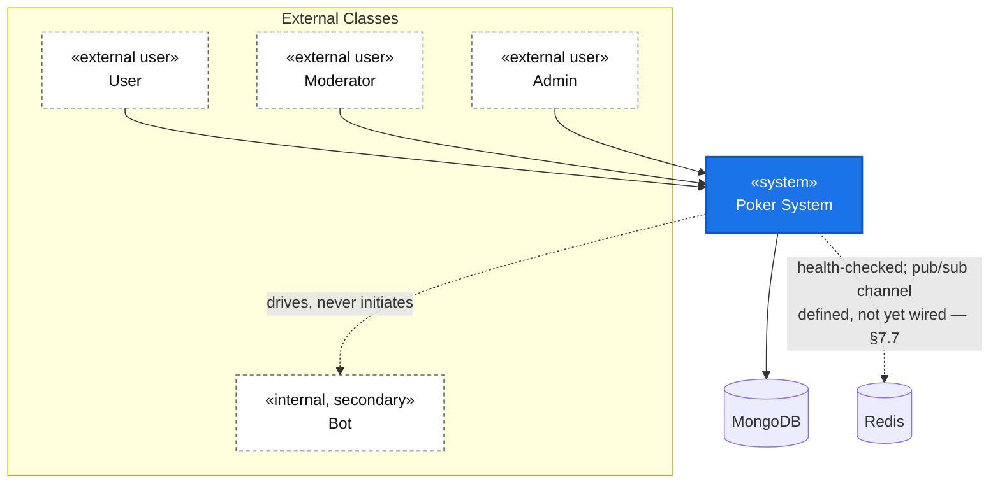

Note: unlike a system with a payment gateway and an email/SMS provider, this diagram has **no
external-system box for either** — there is no payment gateway (chips are an internal ledger
only) and no email/SMS provider anywhere in the system.

### 5.2 Entity Class Model — Conceptual Static Model

Two clusters: **Persistent Entities** (MongoDB-backed, survive process restarts) and **In-Memory
Domain Types** (from the rules engine — exist only while a hand is running).

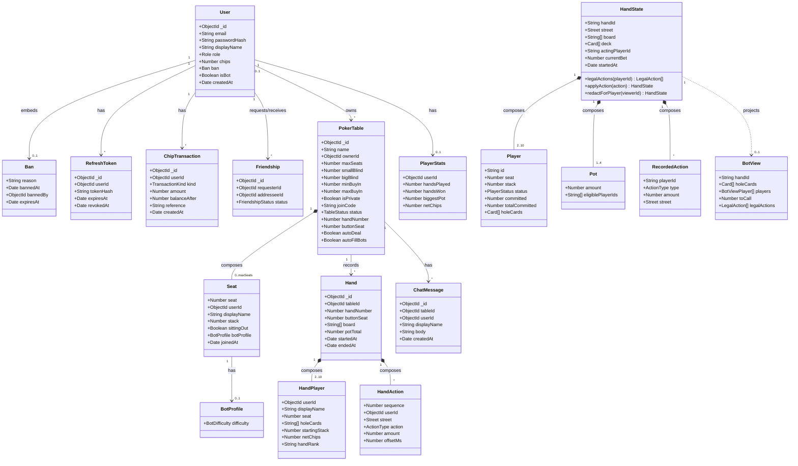

### 5.3 Key Entity Attributes and Invariants

| Entity | Key invariants |
|---|---|
| `User.chips` | Never negative; every change is accompanied by exactly one `ChipTransaction` row with a matching `balanceAfter`. |
| `User.email` | Unique, case-insensitive, enforced by a collation index — not application logic. |
| `Ban.expiresAt` | Null means indefinite; a past-dated value is lazily cleared on the next auth attempt, not by a background job. |
| `PokerTable.seats` | Fixed length for the table's lifetime; seat count never changes after creation. |
| `PokerTable.status` | `in_hand` if and only if the corresponding in-memory hand is non-null and not complete. |
| `Seat.botProfile` | Non-null only when the seat's user is a bot account; a human seat always has a null profile. |
| `Hand.players[].holeCards` | Non-null only for a player who reached a contested showdown at settlement. |
| `HandState.deck` | Never serialized outside the server process; length decreases monotonically within a hand. |
| `HandState.pots[].eligiblePlayerIds` | A subset of players whose total committed chips reached that pot's commitment level; bounds the maximum win from each opponent. |
| `PlayerStats` | Exists only for human accounts that have played at least one hand; never created or updated for a bot. |

---

## 6. Analysis Modeling — Object and Class Structuring

### 6.1 Object Structuring Categories

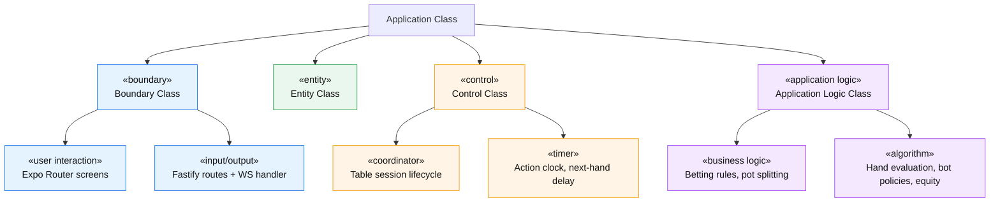

### 6.2 Object Allocation by Category

**«boundary» — User interaction objects (Expo Router screens)**

| Object | Responsibility | Realizes |
|---|---|---|
| `IndexScreen` | Combined login/register form and table lobby | UC-U01, UC-U02, UC-U10 |
| `TableScreen` | Live table: seats, board, action bar, hand log, chat | UC-U11…U20 |
| `WalletScreen` | Balance, deposit/withdraw, transaction history | UC-U06…U09 |
| `ModerationScreen` | Table administration and trust/safety console | UC-M01…M12, UC-A01 |
| `FriendsScreen` † | Friends / requests / find-people | UC-U21 (mocked) |
| `LeaderboardScreen` † | Rankings by scope | UC-U22 (mocked) |
| `HistoryScreen` † | Cross-table "my hands" view | UC-U23 (mocked) |

**«boundary» — I/O objects (Fastify)**

| Object | Responsibility |
|---|---|
| `authRoutes` | HTTP boundary for register/login/refresh/logout |
| `walletRoutes` | HTTP boundary for deposit/withdraw/history |
| `tableRoutes` | HTTP boundary for lobby/join/leave/bots/hand-log |
| `moderationRoutes` | HTTP boundary for table admin and trust/safety, role-gated |
| `realtimeRoutes` | WebSocket boundary — message dispatch, per-socket auth |
| `requireAuth`, `requireRole` | Boundary guards enforcing authentication and RBAC before a handler runs |

**«entity» — Persistence-facing objects**

Typed collection accessors, one per MongoDB collection: `User`, `RefreshToken`,
`ChipTransaction`, `Friendship`, `PokerTable`, `Hand`, `ChatMessage`, `PlayerStats`. There is no
ORM layer beyond these typed accessors.

**«control» — Control objects**

| Object | Kind | Coordinates |
|---|---|---|
| `Table` | coordinator | The per-table session: hand lifecycle, the action timer, listener fan-out |
| Table registry | coordinator | Lazily loads a table from MongoDB into the live in-memory instance; releases it on close |
| Bot driver | coordinator | *When* and *how* a bot acts; delegates all decision-making to the rules engine |
| Opponent-stats store | coordinator | Builds the opponent-modelling context fed to the expert bot tier |
| Token lifecycle | coordinator | Session issuance, rotation, and revocation |

**«application logic» — Business logic and algorithm objects (the rules engine, pure, no I/O)**

| Object | Kind | Encapsulated rule |
|---|---|---|
| Betting state machine | business logic | Legal-action computation, action application, street advancement |
| Hand evaluator | algorithm | Best five-card hand scoring and comparison |
| Pot builder | algorithm | Side-pot construction and odd-chip-safe splitting |
| Bot view projector | algorithm | The compile-time card-visibility barrier for bot policies |
| Bot policies (easy/medium/hard/expert) | algorithm | Weighted-random through Monte-Carlo-equity decision making |
| Decision clamp | business logic | Forces any policy's raw output into a legal action before use |

### 6.3 Object Interaction — UC-U14 Play a Betting Action

Chosen for the sequence diagram because it is the system's defining architectural risk: unlike a
request/response flow, it must show boundary→control→application-logic layering *and* fan-out
broadcast to every viewer, plus a conditional re-entrant call into the same path for a bot's
subsequent turn.

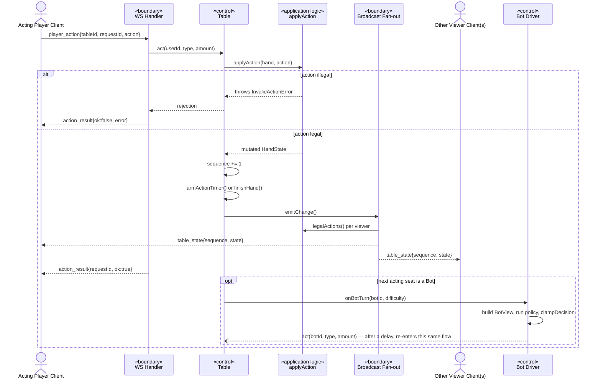

### 6.4 State-Dependent Control — Table Lifecycle

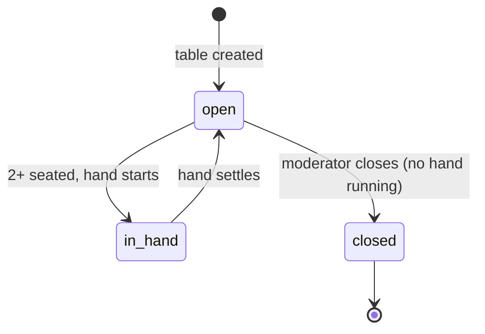

### 6.5 State-Dependent Control — Hand / Street Lifecycle

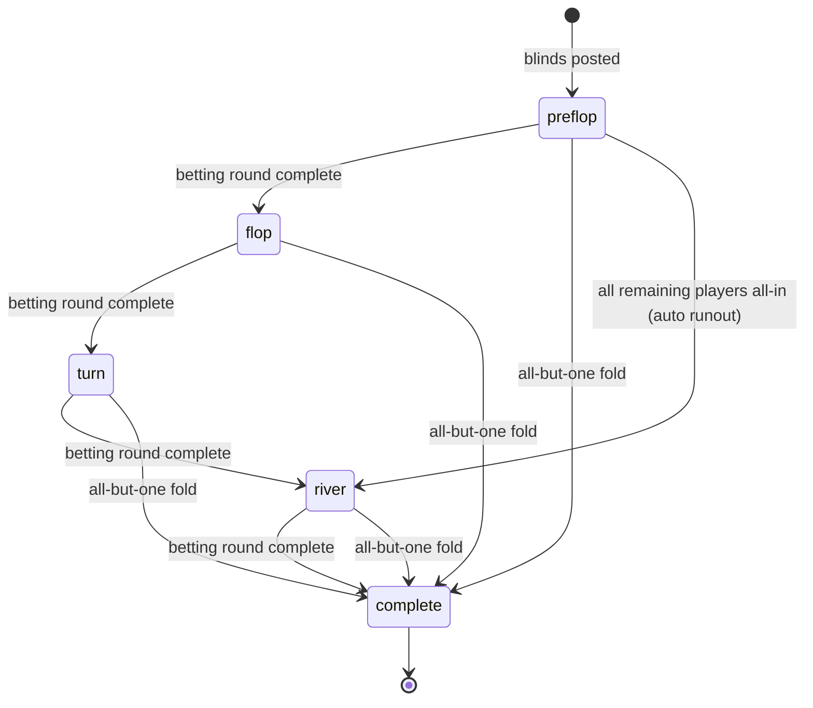

### 6.6 State-Dependent Control — Player Status Within a Hand

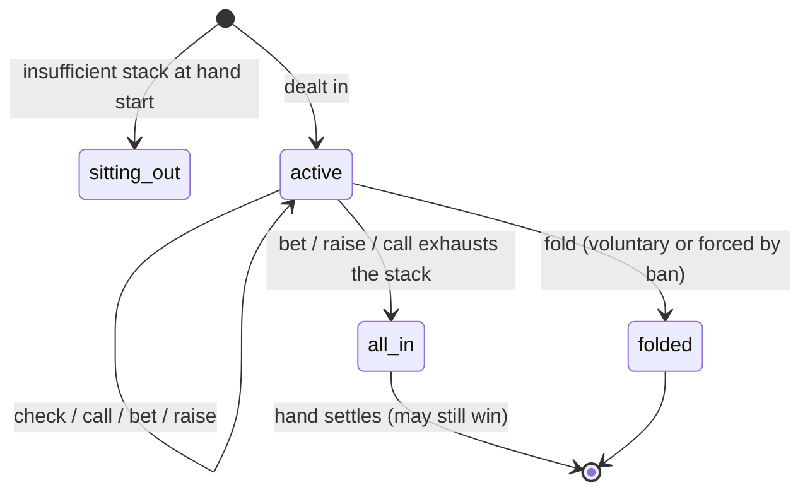

Three diagrams were chosen over five candidates (table status, hand street, player status, ban
presence, refresh-token revocation). A user's ban is a near-binary present/absent flag with one
lazy self-transition — better documented as a note in UC-U03 than a full diagram. Refresh-token
revocation is a single one-way transition with too few states to justify one.

---

## 7. Overall Software Architecture

### 7.1 Architectural Style

The system uses a **layered client-server architecture with a realtime channel**: a
stateless-per-request REST API (Fastify) handles account, wallet, lobby, and moderation
operations, while a stateful, single-process, in-memory game-session layer — one live table
instance per table — is fronted by a WebSocket gateway for gameplay. This is a hybrid of a
classic layered architecture (routes → control → domain → data) and an actor-per-table in-memory
session model, not a pure microservice or event-sourced design. Persistence is write-behind for
hands (only the finished hand is durably written) but write-through for money (every chip
movement is synchronously ledgered).

| Layer | Contents |
|---|---|
| Presentation | Expo Router screens, rendering natively and on the web from one source |
| API Gateway / Boundary | Fastify routes, the WS handler, auth/RBAC middleware |
| Control / Orchestration | The table session coordinator, the registry, the bot driver, opponent-stats, token lifecycle |
| Application Logic / Domain | The rules engine — pure, dependency-free |
| Data Access | Typed MongoDB collection accessors |
| Persistence | MongoDB replica set, Redis |

A cross-cutting **Shared Contracts** layer — the Zod schemas both the client and server compile
against — sits beside these layers rather than inside them: when a contract changes, both sides
fail to compile rather than failing at runtime.

### 7.2 Layered Architecture Diagram

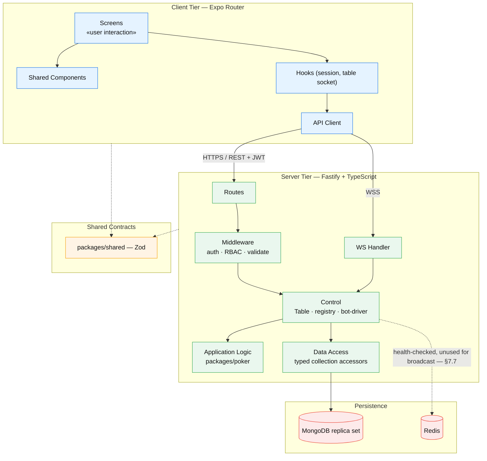

### 7.3 Subsystem Decomposition

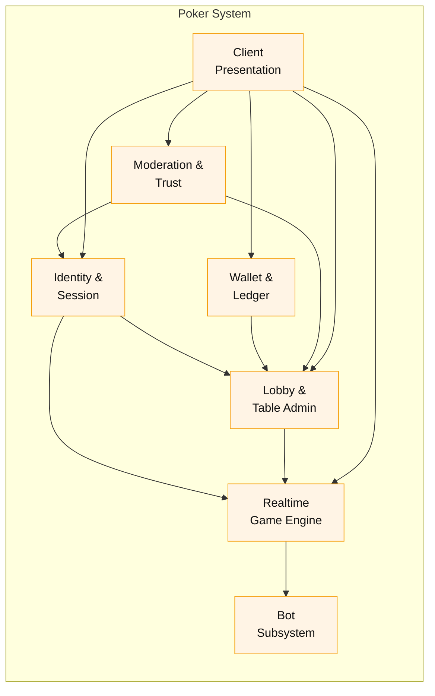

| Subsystem | Responsibility | Key files |
|---|---|---|
| Identity & Session | Register/login/refresh/logout, ban gating | `routes/auth.ts`, `lib/tokens.ts` |
| Wallet & Ledger | Atomic chip movements, transaction history | `routes/wallet.ts` |
| Lobby & Table Administration | Table listing/join/leave, moderator table CRUD | `routes/tables.ts`, `routes/moderation.ts` (table half) |
| Realtime Game Engine | Live hand state, WS protocol, broadcast | `game/table-manager.ts`, `game/registry.ts`, `routes/realtime.ts`, `packages/poker` |
| Bot Subsystem | Automated seat decisions, opponent modelling | `game/bot-driver.ts`, `game/opponent-stats.ts`, `packages/poker/src/bot/*` |
| Moderation & Trust | Ban/unban, role assignment, user search | `routes/moderation.ts` (user half) |
| Client Presentation | Cross-platform UI for all of the above | `apps/client/src/app/*` |

### 7.4 Package Diagram

#### 7.4.1 Top-Level Package Structure

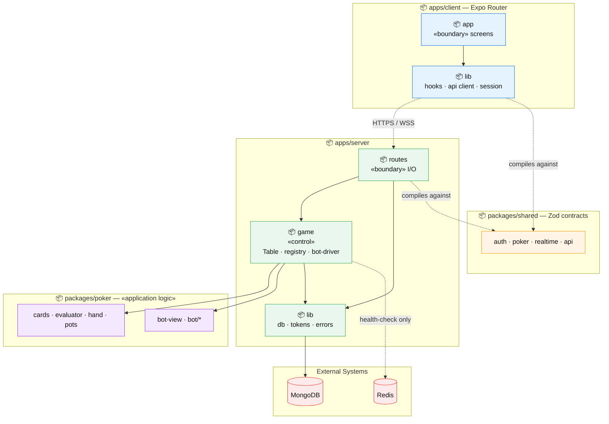

#### 7.4.2 Layered Package Dependencies

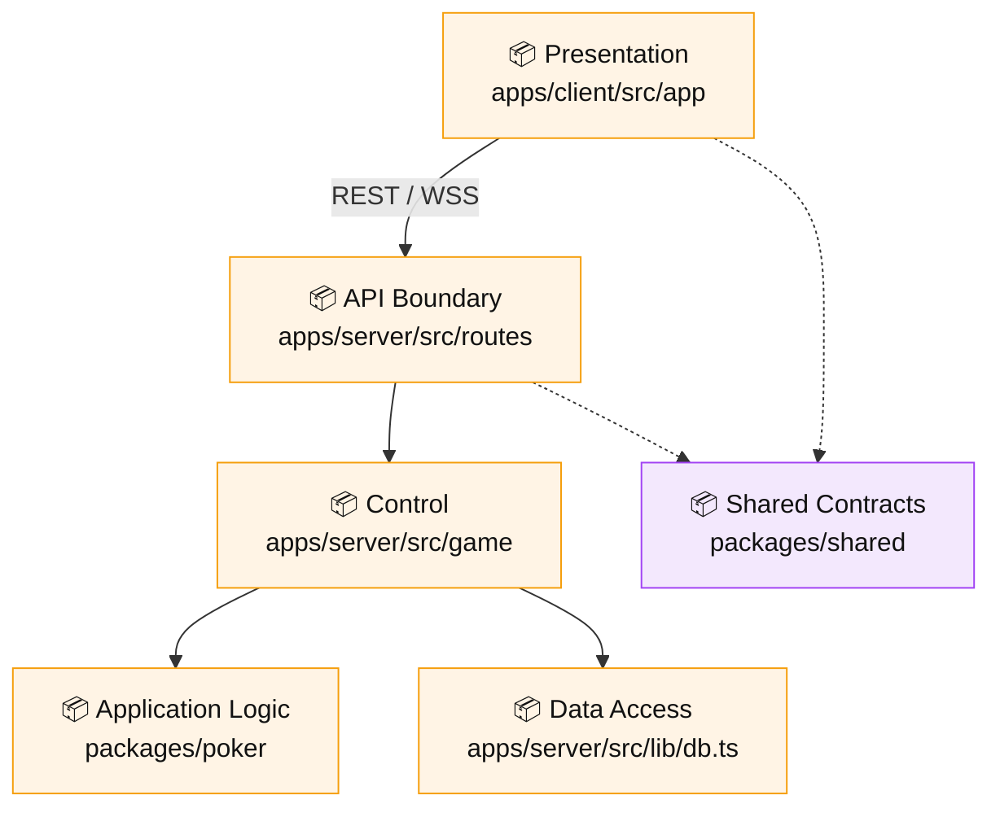

Note the one arrow that does **not** exist: `packages/poker` depends on nothing else in the
repository — not `packages/shared`, not any server file. This confirms the rules engine has zero
coupling to the wire-protocol contracts, which is what makes it independently unit-testable with
no mocking.

#### 7.4.3 Dependency Rules

| From | To | Allowed? | Rationale |
|---|---|---|---|
| `routes/*` | `game/*` | Yes | Boundary delegates to control |
| `routes/*` | `packages/poker` | No (not observed) | Routes never call rules-engine functions directly — always through the `Table` coordinator |
| `game/*` | `packages/poker` | Yes | Control orchestrates pure domain logic |
| `packages/poker` | `game/*`, `lib/db.ts`, any I/O | **No — enforced by design** | The rules engine must stay pure, testable, and free of I/O |
| `apps/client` | `apps/server` internals | No | The client only talks to the server over HTTP/WS, never imports server code |
| `apps/client`, `apps/server` | `packages/shared` | Yes | Both compile against the same contracts |

**Why `game/table-manager.ts` is the one seam that imports both application logic and data
access.** It is the intentional glue between pure rules-engine calls and MongoDB persistence — a
deliberate concentration point rather than a layering violation, because nothing above or below
it needs to know both.

### 7.5 Deployment Architecture

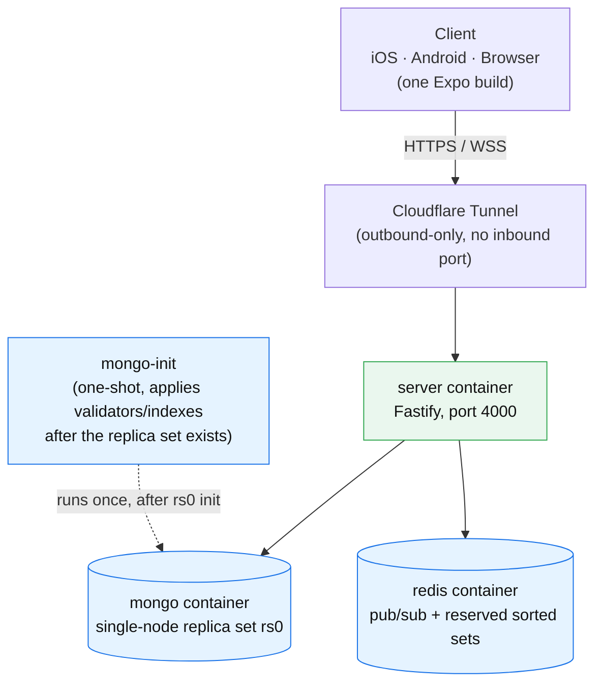

The API deliberately does **not** run on a serverless platform — serverless execution limits are
incompatible with long-lived WebSocket connections. A serverless static host is used only for the
client's web export, never for the server.

### 7.6 Representative API Surface

| Method | Endpoint | Use case | Auth |
|---|---|---|---|
| POST | `/api/v1/auth/register` | UC-U01 | Public |
| POST | `/api/v1/auth/login` | UC-U02 | Public |
| POST | `/api/v1/auth/refresh` | UC-U04 | Public (valid refresh token) |
| GET | `/api/v1/wallet` | UC-U06 | User |
| POST | `/api/v1/wallet/withdraw` | UC-U08 | User |
| GET | `/api/v1/tables` | UC-U10 | User |
| POST | `/api/v1/tables/:id/join` | UC-U11 | User |
| GET | `/api/v1/tables/:id/hands` | UC-U20 | User (seated) / Moderator |
| POST | `/api/v1/tables/:id/deal` | (manual trigger) | User |
| POST | `/api/v1/moderation/tables` | UC-M01 | Moderator/Admin |
| DELETE | `/api/v1/moderation/tables/:id` | UC-M02 | Moderator/Admin |
| POST | `/api/v1/tables/:id/bots` | UC-M04 | Owner/Admin |
| POST | `/api/v1/moderation/users/:id/ban` | UC-M09 | Moderator/Admin |
| PUT | `/api/v1/moderation/users/:id/role` | UC-A01 | Admin only |
| GET | `/ws` | UC-U14, UC-U16, UC-U17, UC-U18 | User (token as query param) |

### 7.7 Architecture Callouts

**Callout A — Single-process realtime state is a real, load-bearing constraint, not an
oversight.** A table's live hand state exists only in the memory of one server process. This is
explicitly by design: two server instances would each hold their own divergent copy of the same
table. The shared contract package *defines* a Redis pub/sub channel name for cross-process table
broadcast, and Redis is connected and health-checked — but no code path in the server actually
publishes or subscribes through that channel. Broadcasting today is entirely an in-process
listener set on the table coordinator. This is worth naming precisely as the gap between an
intended future architecture (Redis-mediated cross-process fan-out, enabling horizontal scaling
of the realtime layer) and the current implementation (in-memory only), rather than presenting
Redis pub/sub as something that already solves horizontal scalability.

**Callout B — Card visibility is decided in three separate places, a documented repeated-logic
smell.** The rules engine's own documentation states this outright: if what a player may see ever
changes, three independent code paths must all change together — the wire-format redaction used
for tests and one internal consumer, the server's per-viewer table-state redaction used for
clients, and the bot-view projector used for policies. All three currently agree (reveal only the
viewer's own cards, or every live player's cards at a contested showdown) — but there is no single
shared function driving all three. This is a legitimate architectural risk: a future change to the
visibility rule could update two of three paths and silently leave the third leaking information.
It is presented here as an honest, named trade-off, not glossed over.

---

## 8. Software Quality Attributes

### 8.1 Attributes and How They Are Achieved

| Attribute | Design decision |
|---|---|
| **Security** | Server-authoritative validation of every action against the rules engine's own legality computation; hole cards and the deck are never serialized to a client beyond what it's entitled to see; bots are structurally unable to access opponents' cards (a compile-time type guarantee, not a runtime check); Argon2id password hashing; a cryptographically secure shuffle, never a predictable random source. |
| **Reliability / Integrity** | Every chip movement is a single atomic conditional update, never read-then-write; duplicate accounts are rejected by a unique index rather than a check-then-insert race; a hand-persistence failure logs and continues rather than wedging the table. |
| **Availability** | A 30-second action timer auto-folds or auto-checks an idle player, so one disconnect cannot freeze a table; a crashed bot policy falls back to check/fold rather than stalling. |
| **Scalability (documented limitation)** | Single-process, in-memory table state is a genuine, acknowledged constraint — horizontal scaling of the realtime layer has no solution yet (see §7.7 Callout A). |
| **Consistency (realtime)** | A reconnect always receives a full snapshot, never a delta replay; clients discard any message not strictly newer than the last one applied. |
| **Auditability** | Every chip movement writes a ledger row carrying the actual post-update balance; every finished hand's public actions are permanently retained for that table. |
| **Fairness / Privacy** | The public-betting/private-cards rule is enforced identically in storage and in every live-view code path (see §7.7 Callout B). |
| **Usability (cross-platform)** | One Expo Router codebase renders iOS, Android, and web without a second implementation to maintain. |

### 8.2 Quality Attribute Scenarios

| # | Attribute | Stimulus | Response | Measure |
|---|---|---|---|---|
| QA-1 | Reliability / Integrity | Twenty concurrent withdrawal requests race against a balance that covers only fifteen of them | Each debit is a single atomic conditional update guarded by the current balance; exactly the requests the balance can cover succeed | Zero lost updates, zero negative balances, under concurrent load |
| QA-2 | Security | A modified client sends an action the UI would never allow — a raise below the minimum, or acting out of turn | The server independently re-derives legality and rejects the request with no state change | 100% of illegal actions rejected server-side regardless of client-side enforcement |
| QA-3 | Security (compile-time) | A bot policy author attempts to read an opponent's hole cards inside a policy function | The bot's view type has no such property at all | The attempt fails at compile time, not merely at code review or runtime |
| QA-4 | Availability | A human player's connection drops or they simply idle mid-turn | The server's 30-second action timer auto-folds, or auto-checks if legal, on their behalf | The table never waits more than 30 seconds for any single player's turn |
| QA-5 | Availability | A bot's policy function throws an unexpected exception | The bot driver catches it, logs it, and immediately submits check, or fold if check is illegal | The table's clock is never consumed waiting on a crashed policy |
| QA-6 | Consistency (realtime) | A client's connection drops and reconnects mid-hand | The server always responds with a full state snapshot at the current sequence, never a partial replay | Client state is fully correct after one round trip, regardless of how many messages were missed |
| QA-7 | Scalability (documented limitation) | Two server instances are run behind a load balancer for the realtime layer | Each instance holds its own independent in-memory table registry; a player connected to instance A never sees an action taken by a player connected to instance B on the same table | Documented as a known architectural constraint, not solved: requires either sticky sessions or a dedicated game-server tier with cross-process state sync |
| QA-8 | Fairness / Privacy | A player folds early in a hand that later reaches a contested showdown among the remaining players | The folded player's hole cards remain absent from the persisted hand and were never broadcast to any other viewer at any point | 0% of folded or mucked hole cards ever appear in any client-facing payload, live or historical |
| QA-9 | Reliability | A database write for a finished hand fails mid-settlement | The failure is caught and logged; the table's in-memory state still advances and the next hand still schedules | The table remains playable for the next hand even though this one hand is missing from history |
| QA-10 | Integrity (game) | A moderator bans a player who is mid-hand and has already committed chips to the pot | The player is force-folded without touching their already-committed chips | The pot total before and after the ban is identical; only the banned player's further participation is removed |

[PROPOSED — confirm with team: exact numeric latency/throughput targets for QA-1, QA-4, and QA-7
where none is stated above. The codebase enforces the *mechanism* — atomicity, timers,
snapshot-on-reconnect — but does not document explicit SLA numbers; any hard number added to the
final document should be a team-chosen target, not an extracted fact.]

---

## 9. Traceability Matrix

Requirements traceability: every detailed use case traces forward to the objects that realize it.

| Use Case | «boundary» | «control» | «application logic» | «entity» | Notes |
|---|---|---|---|---|---|
| UC-U01 Register | `IndexScreen`, auth routes | — | — | `User`, `ChipTransaction`, `PlayerStats` | No control object — thin enough that the route talks straight to the data layer. |
| UC-U02 Login | `IndexScreen`, auth routes | Ban-check helper | — | `User` | The constant-time dummy-hash check lives in the boundary handler itself, not a separate object. |
| UC-U11 Join Table | `TableScreen`, table routes | `Table`, registry lookup | Betting state machine start-hand | `PokerTable`, `User`, `ChipTransaction` | The seat-claim race is resolved entirely at the data layer (a conditional update); no distributed lock object exists. |
| UC-U14 Play a Betting Action | `TableScreen` action bar, WS handler | `Table` action handler, action timer | Action application, legal-action computation | `PokerTable` (in-memory reference only; no write until the hand completes) | The 30-second timer and the bot-turn hook both live inside the same timer-arming method — a minor cohesion note, not a defect. |
| UC-U14a Showdown & Settlement | (no direct trigger — surfaces via the `hand_finished` broadcast) | `Table` settlement, opponent-stats recorder | Pot construction, hand evaluation, pot splitting | `Hand` (insert), `PokerTable` (seat/status update), `PlayerStats` (increment) | Persist-then-notify ordering is a correctness requirement enforced by code placement, not by an explicit transaction. |
| UC-U07/08 Wallet Deposit/Withdraw | `WalletScreen`, wallet routes | Chip-change helper (see note 2) | — | `User` (atomic update), `ChipTransaction` (insert) | See note 2 below on this helper's layering. |
| UC-U20 View Table Hand Log | `TableScreen` hand-log panel, table routes | — | — | `Hand` (read, cursor-paginated) | The "tendencies" view has no server-side object at all — see note 3. |
| UC-M09 Ban User | `ModerationScreen` Players tab, moderation routes | Force-fold on live tables, session revocation | Fold action (mid-turn path only) | `User` (ban field), `PokerTable` (seat, via the live table instance) | Crosses three subsystems in one use case — the widest fan-out of any single use case in this system. |
| UC-M01 Create Table | `ModerationScreen` Tables tab, moderation routes | — | — | `PokerTable` (insert) | No control object needed — a table isn't "live" until first accessed, so creation is pure data-layer work. |
| UC-M02 Close Table | `ModerationScreen` Tables tab, moderation routes | Registry peek (read-only check), registry release | — | `PokerTable` (update) | Uses a non-creating lookup so closing a table that was never instantiated live doesn't spuriously create one just to check it. |
| UC-M04 Add Bot to Table | `TableScreen` add-bot sheet, table routes | `Table` start-hand, bot driver (subsequent turns) | Bot view projection, policy functions, decision clamp | `PokerTable` (seat update), `User` (bot account, read-only lookup) | Bot accounts are read-only from this use case's perspective — provisioned entirely outside the request path by a seed script. |
| UC-A01 Assign/Change Role | `ModerationScreen` Players tab, moderation routes (admin-only gate) | Session revocation | — | `User` (role update) | Gated by a stricter role check than its sibling ban route — worth calling out as a granularity difference within the same file. |

**Implementation notes**

1. Several use cases (Register, Login, Create Table, Close Table) have **no control object** — the
   boundary talks directly to the entity layer. A control object appears only where an in-memory
   session or a multi-step coordinated side effect is involved.
2. The chip-change helper used by wallet deposit/withdraw is also reused by table join/leave for
   buy-in and cash-out — it functions as a shared entity-layer operation despite being physically
   defined inside a routes file. A stricter layering would relocate it to the data-access layer.
3. The "tendencies" view on the client's hand-log panel derives entirely from data already fetched
   for the action-replay view; no additional server call, endpoint, or object exists for it.
4. Card-visibility logic is implemented three times rather than once — see §7.7 Callout B. No
   single row in this matrix can claim to be "the" card-visibility object; it is intentionally
   decentralized today, by convention rather than by a shared abstraction.
5. The Redis pub/sub channel defined in the shared contracts is not called from any server file —
   see §7.7 Callout A. Today's broadcast fan-out is exclusively the in-process listener set.
6. UC-U19 (chat backlog), UC-U21 (friends), UC-U22 (leaderboard), and UC-U23 (my hand history) are
   intentionally excluded from the detailed rows above because they have no server-side control,
   application-logic, or entity implementation yet — only client-side mock screens backed by
   pre-defined contracts. If a future revision of this document adds traceability rows for them,
   every Control/Application-Logic/Entity cell should read "Not yet implemented" rather than be
   left blank.

---

## Appendix A — Source Artifacts

| Artifact | Location |
|---|---|
| Repository layout and engineering rules | `AGENTS.md` |
| Existing architecture notes | `docs/ARCHITECTURE.md` |
| Deployment notes | `docs/DEPLOYMENT.md` |
| UI/design system notes | `docs/DESIGN.md` |
| Rules engine source | `packages/poker/src/` |
| Shared API contracts | `packages/shared/src/` |
| Server source | `apps/server/src/` |
| Client source | `apps/client/src/app/` |
